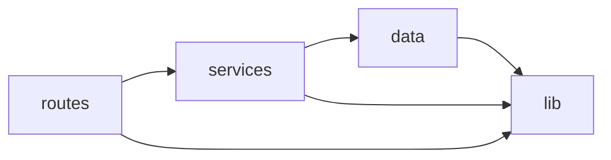
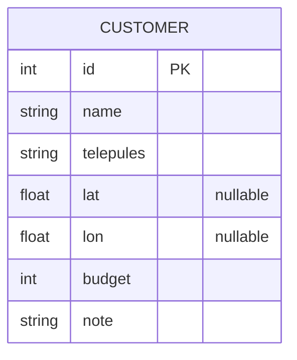

# Architecture Spine — Ügyfél-távolság szolgáltatás (offline REST)

## Design Paradigm

**Rétegzett (layered) architektúra** tiszta magrutinokkal. A függőség iránya befelé mutat:

- **routes** (Fastify plugin-ök) — HTTP be/ki, validáció, szerializálás. Csak service-t hív.
- **services** — üzleti logika (betöltés, geokódolás, rendezés). Csak repository-t és pure util-t hív.
- **data** — Prisma Client + repository függvények; az egyetlen DB-elérési pont.
- **lib (pure core)** — `normalize`, `haversine`, `geo-reference`. IO nélküli, önmagában tesztelhető.

Namespace-térkép: `src/routes`, `src/services`, `src/data`, `src/lib`.

## Invariants & Rules

### AD-1 — Rétegzett függőségi irány [ADOPTED]
- **Binds:** all
- **Prevents:** hogy a HTTP-réteg közvetlenül Prismát/SQL-t hívjon, vagy a pure core IO-t végezzen → körkörös/átszivárgó függőségek.
- **Rule:** a függőség csak befelé mutathat: `routes → services → data`, és bárki hívhat `lib`-et. `lib` semmit sem importál a többi rétegből. `data` az egyetlen, ami Prisma Clientet lát.



### AD-2 — Egyetlen normalizáló a település-egyeztetéshez [ADOPTED]
- **Binds:** FR-2, FR-3
- **Prevents:** hogy a seed és bármely jövőbeli lookup eltérően normalizáljon (pl. az egyik ékezetet bont, a másik nem) → néma egyeztetési divergencia.
- **Rule:** egyetlen `normalizeTown(s)` függvény a `src/lib/normalize.js`-ben az egyeztetés kizárólagos kulcsforrása. Lépések rögzített sorrendben: `trim` → `toLowerCase` → Unicode NFD + diakritikus jelek eltávolítása (`\p{Diacritic}`). A geokódoló-referencia és minden egyeztetés EZT használja.

### AD-3 — Geokódolás betöltéskor, statikus bundle-olt referenciából [ADOPTED]
- **Binds:** FR-2, FR-4
- **Prevents:** futásidejű külső hívást és a `by-distance` nemdeterminisztikus/lassú viselkedését.
- **Rule:** a `telepules → {lat, lon}` leképezés statikus modul (`src/lib/geo-reference.js`), normalizált kulcsokkal. A koordináta-hozzárendelés a **seed idején** történik és a DB-be íródik (`lat`,`lon`); a végpontok már a perzisztált koordinátákból dolgoznak. Futásidőben SEMMILYEN hálózati hívás. Nem talált település → `lat=null, lon=null`, WARN log, a folyamat folytatódik (nem dob).

### AD-4 — Idempotens seed természetes kulcson [ADOPTED]
- **Binds:** FR-1
- **Prevents:** duplikált sorokat ismételt seed-futtatáskor.
- **Rule:** a `customers` táblán egyedi megszorítás a `(name, telepules)` páron. A seed `prisma.upsert`-tel dolgozik ezen a kulcson (insert vagy update), így kétszeri futtatás után is 15 sor. A `lat/lon/budget/note` frissül upsertkor.

### AD-5 — Távolság és rendezés a service-rétegben, rögzített szabállyal [ADOPTED]
- **Binds:** FR-6
- **Prevents:** eltérő kerekítést/rendezést/null-kezelést a végpontok között.
- **Rule:** a `by-distance` service minden ügyfélre `haversine(BUDAPEST, {lat,lon})`-t számol. `BUDAPEST` rögzített konstans a `geo-reference`-ben. `distanceKm` 1 tizedesre kerekítve (`Math.round(x*10)/10`). Rendezés: (1) ismert koord növekvő `distanceKm` szerint, (2) ismeretlen koord (`null`) a lista végén, (3) minden holtversenyben — a null-blokkon belül is — másodlagos kulcs `name` növekvő. A budapesti ügyfél `distanceKm = 0.0` és elöl van.

### AD-6 — Pure, null-biztos haversine util [ADOPTED]
- **Binds:** FR-7
- **Prevents:** hogy a távolságszámítás DB-hez/IO-hoz kötődjön → tesztelhetetlenség; és a null-koordináta miatti crash.
- **Rule:** `src/lib/haversine.js` egyetlen tiszta függvény: két `{lat,lon}` pontból km-t ad; ha bármelyik koordináta `null`/`undefined`, `null`-t ad vissza (nem dob). R = 6371 km. Nincs import más rétegből → közvetlenül unit-tesztelhető.

## Consistency Conventions

| Concern | Convention |
| --- | --- |
| Naming | Fájlok: kebab-case (`geo-reference.js`). Függvények: camelCase. DB-oszlop `telepules` (magyar, a domain-nyelvhez igazodva), a többi angol. |
| Data & formats | Válasz JSON, mezőnevek camelCase (`distanceKm`, `countryCode`). `count` egész. `distanceKm` szám 1 tizedessel vagy `null`. Hibaválasz Fastify alapértelmezett `{statusCode,error,message}`. |
| State & cross-cutting | Mutáció csak `data` rétegen át. Logolás Fastify beépített pino loggerrel (ismeretlen település → `warn`). Konfiguráció env-ből (`DATABASE_URL`), `.env` a repo gyökérben. Nincs auth. |

## Stack

| Name | Version |
| --- | --- |
| Node.js | 22 LTS |
| Fastify | ^5 |
| Prisma (ORM + Migrate) | ^6 |
| PostgreSQL | 16 (Docker) |
| Vitest | ^3 |

## Structural Seed

```text
hf2/
  prisma/
    schema.prisma        # Customer model, @@unique([name, telepules])
    migrations/          # verziózott Prisma Migrate migrációk
  seed/
    seed-customers.json  # a bemeneti 15 ügyfél (adott)
  src/
    lib/
      normalize.js       # normalizeTown() — AD-2
      geo-reference.js    # telepules->{lat,lon} + BUDAPEST konstans — AD-3
      haversine.js       # pure, null-biztos táv — AD-6
    data/
      prisma.js          # PrismaClient singleton
      customers-repo.js  # upsert, findAll, count
    services/
      seed-service.js    # betöltés + geokódolás (AD-3, AD-4)
      customers-service.js # count, by-distance rendezés (AD-5)
    routes/
      customers.js       # GET /customers/count, GET /customers/by-distance
    app.js               # Fastify app összeállítás (plugin regisztráció)
    server.js            # listen()
  scripts/
    seed.js              # a seed-service futtatója (idempotens; kétszer is futtatható)
  test/
    haversine.test.js    # FR-7 unit tesztek
  docker-compose.yml     # helyi Postgres
  .env                   # DATABASE_URL
  README.md
```

Core entitás (ERD triviális — egyetlen tábla):



Deployment / környezet: helyi fejlesztés `docker-compose` Postgres-szel; a séma `prisma migrate deploy`, az adat `node scripts/seed.js`. Postgres MCP a fejlesztői környezetben a `DATABASE_URL`-re kötve (séma/adat láthatóság). Nincs felhő-deploy az MVP-ben.

## Capability → Architecture Map

| Capability / Area | Lives in | Governed by |
| --- | --- | --- |
| FR-1 Idempotens seed | `services/seed-service.js`, `data/customers-repo.js`, `schema.prisma` | AD-4 |
| FR-2 Offline geokódolás | `lib/geo-reference.js`, `services/seed-service.js` | AD-3 |
| FR-3 Robusztus egyeztetés | `lib/normalize.js` | AD-2 |
| FR-4 Ismeretlen település | `services/seed-service.js` | AD-3 |
| FR-5 count | `routes/customers.js`, `data/customers-repo.js` | AD-1 |
| FR-6 by-distance | `services/customers-service.js`, `lib/haversine.js` | AD-5 |
| FR-7 haversine tesztek | `lib/haversine.js`, `test/haversine.test.js` | AD-6 |

## Deferred

- **Konténerizált app-deploy / CI pipeline** — MVP-n kívül; a README kézi lépései elegendők.
- **Budapest kerület-bontás** — csak ha a seed később kerületeket tartalmaz; az `normalizeTown` bővíthető prefix-illesztéssel.
- **Végpont-lapozás/szűrés** — nincs rá igény a 15 rekordnál.
- **Referencia-bővítés új városokra** — a `geo-reference` bővítendő, ha a seed nő; szándékosan nem duzzasztjuk fel előre (SM-C1).
